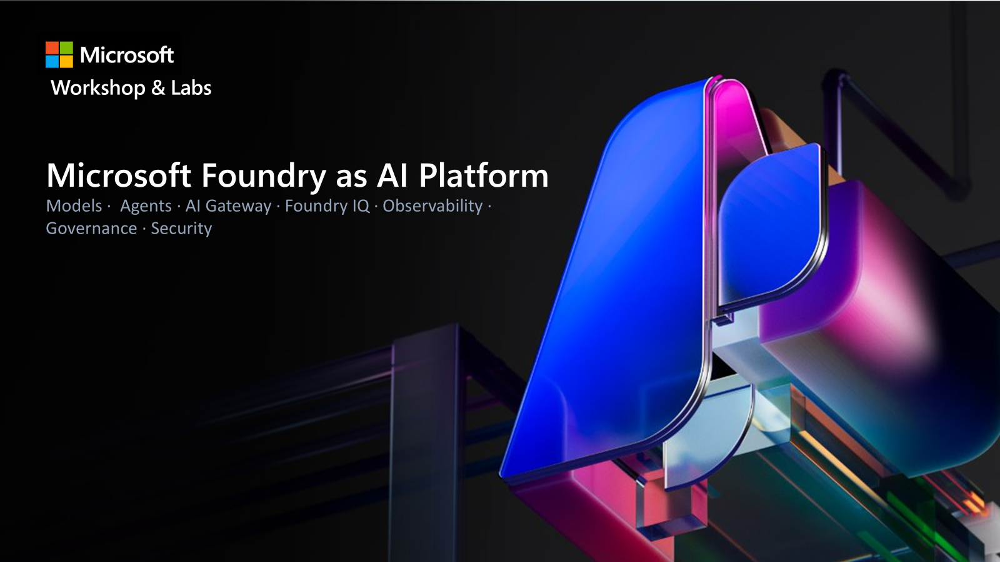

# Microsoft Foundry Workshop — Getting Started



> **Repository:** [https://github.com/RenatoSGR/foundry-workshop](https://github.com/RenatoSGR/foundry-workshop)

## About this Workshop

A hands-on introductory workshop on **Microsoft Foundry**, designed for participants with little prior experience. You'll explore AI models, create intelligent agents, build multi-agent workflows, and configure governance with AI Gateway.

> **Note:** This workshop uses the **new Foundry portal** (toggle "New Foundry" enabled at [ai.azure.com](https://ai.azure.com)). Make sure the toggle is active before you begin.

## 📋 Prerequisites

Before the workshop, make sure you have:

- [ ] An Azure account with an **active subscription** ([create a free account](https://azure.microsoft.com/free/))
- [ ] A **Microsoft Foundry project** already created ([portal](https://ai.azure.com))
- [ ] A **GPT-4o** model deployed in the project (deployment name: `gpt-4o`)
- [ ] A **text-embedding-ada-002** model deployed (deployment name: `text-embedding-ada-002`) — optional, for embeddings
- [ ] **Python 3.10+** installed (already included in Codespaces)
- [ ] **Azure CLI** installed and authenticated (`az login`) — optional, enables auto-discovery
- [ ] **VS Code** installed (recommended) with Jupyter extension
- [ ] **Git** installed

## ⚡ Quick Setup (5 minutes)

### Option A: GitHub Codespaces (fastest) ☁️

[](https://codespaces.new/RenatoSGR/foundry-workshop?machine=basicLinux32gb)

1. Click the button above (or go to the repository on GitHub → **Code** → **Codespaces** → **Create codespace on main**)
2. Wait for the environment to load (dependencies install automatically)
3. In the terminal, run:
   ```bash
   python setup_env.py
   ```
4. The script will ask for values from the portal ([ai.azure.com](https://ai.azure.com) → your project → **Build** → **Models** for endpoints)

> In Codespaces, Azure CLI comes pre-installed. If you run `az login`, the script discovers everything automatically.

### Option B: Local

```bash
# 1. Clone the repository
git clone https://github.com/RenatoSGR/foundry-workshop.git
cd foundry-workshop

# 2. Create a virtual environment
python -m venv .venv

# Windows
.venv\Scripts\activate

# macOS/Linux
source .venv/bin/activate

# 3. Install dependencies
pip install -r requirements.txt

# 4. Configure .env
python setup_env.py
```

The `setup_env.py` script works in **two modes**:
- **With Azure CLI** (`az login`): automatically discovers your project, extracts endpoints and keys
- **Without Azure CLI** (Codespaces, etc.): prompts for values manually — copy from the portal at [ai.azure.com](https://ai.azure.com)

> **Manual alternative:** Copy `.env.template` to `.env` and fill in the values by hand.

## 📁 Repository Structure

```
foundry-workshop/
├── README.md                          # This file
├── requirements.txt                   # Python dependencies
├── setup_env.py                       # Automatic configuration script
├── .env.template                      # Configuration template (manual)
├── labs/
│   ├── lab01/
│   │   ├── README.md                  # Step-by-step guide
│   │   └── lab01-modelos.ipynb        # Lab 1: Models and Deployments (1 hour)
│   ├── lab02/
│   │   ├── README.md                  # Step-by-step guide
│   │   ├── self-hosted-agents.md      # Lab 2.3: Hosted Agents guide
│   │   ├── lab02-agentes.ipynb        # Lab 2: Local Agents with Tools (1 hour)
│   │   └── lab02.1-agentes.ipynb      # Lab 2.1: Agents with Agent Service (1 hour)
│   ├── lab03/
│   │   ├── README.md                  # Step-by-step guide
│   │   └── lab03-model-workflows.ipynb # Lab 3: Workflows with LLM (1 hour)
│   ├── lab04/
│   │   ├── README.md                  # Step-by-step guide
│   │   └── lab04b-agent-workflows.ipynb # Lab 4: Multi-Agent Workflows (1 hour)
│   ├── lab05/
│   │   └── README.md                  # Lab 5: Knowledge & RAG with Foundry IQ (guide)
│   └── lab06/
│       └── README.md                  # Lab 6: Governance with AI Gateway (guide)
└── data/
    └── documents/                    # Sample documents
```

## 🗺️ Agenda

| # | Lab | Duration | Topics |
|---|-----|----------|--------|
| 1 | [Models and Deployment](labs/lab01/) | 1 hour | Model deployment, consuming via code, chat completions |
| 2 | [Local Agents](labs/lab02/) | 1 hour | Creating local agents, tools, function calling |
| 2.1 | [Agents with Agent Service](labs/lab02/) | 1 hour | Prompt agents, `AIProjectClient`, Agents Playground |
| 2.3 | [Hosted Agents](labs/lab02/self-hosted-agents.md) | 1 hour | Hosted agents, containers, custom code on Foundry |
| 3 | [Workflows with LLM](labs/lab03/) | 1 hour | Prompt chaining, chained pipelines, Workflow Agents |
| 4 | [Multi-Agent Workflows](labs/lab04/) | 1 hour | ConnectedAgentTool, visual workflows, orchestration |
| 5 | [Knowledge & RAG](labs/lab05/) | 1 hour | Foundry IQ, Knowledge Base, AI Search, agentic retrieval |
| 6 | [Governance with AI Gateway](labs/lab06/) | 1 hour | AI Gateway, APIM, token limits, quotas, governance |


## 🔧 .env Configuration

### Option 1: Automatic (recommended) 🚀

```bash
python setup_env.py
```

The script handles everything for you:
1. Verifies you're authenticated with Azure CLI
2. Lists your Foundry projects and asks you to choose
3. Extracts the endpoint and key from the associated AI Services
4. Detects AI Search (if available) and extracts endpoint/key
5. Generates the `.env` file ready to use

### Option 2: Manual

Copy `.env.template` to `.env` and fill in:

| Variable | Where to find |
|----------|---------------|
| `AZURE_AI_FOUNDRY_ENDPOINT` | Foundry Portal → your project → **Build** → **Models** → Endpoint |
| `AZURE_AI_FOUNDRY_KEY` | Foundry Portal → your project → **Operate** → **Admin** → Keys |
| `MODEL_DEPLOYMENT` | Chat model deployment name (e.g., `gpt-4o`) |
| `EMBEDDING_DEPLOYMENT` | Embeddings deployment name (e.g., `text-embedding-ada-002`) |
| `AZURE_SEARCH_ENDPOINT` | Azure Portal → AI Search → Overview → URL |
| `AZURE_SEARCH_KEY` | Azure Portal → AI Search → Keys → Admin Key |

> **Note:** In Foundry, you only need **one endpoint and one key** for everything (chat, embeddings, agents). There's no need to configure separate `AZURE_OPENAI_*` variables.

## 🧭 Foundry Portal Navigation (Quick Reference)

The new Foundry portal has its main navigation in the **top menu**:

| Menu | What you'll find |
|------|-----------------|
| **Home** | Project home page |
| **Discover** → **Models** | Model catalog (deploy new models) |
| **Build** → **Models** | Existing deployments and Playground |
| **Build** → **Agents** | Create and manage agents (Prompt, Workflow, Hosted) |
| **Build** → **Tools** | Tool catalog (MCP servers, functions) |
| **Build** → **Knowledge** | Foundry IQ — knowledge bases and sources |
| **Operate** → **Tracing** | Monitoring and agent tracing |
| **Operate** → **Quota** | Quota management |
| **Operate** → **Admin** | Users, permissions, resources |

> 📖 **Reference:** [Migrate from the Foundry (classic) portal](https://learn.microsoft.com/azure/foundry/how-to/navigate-from-classic)

## 💡 Tips

- **Don't worry about complex code** — the notebooks are ready to go, just run `python setup_env.py`
- **Follow the steps in order** — each lab builds on the previous one
- **If you get an error** — check that `.env` is correct and the models are deployed
- **New Foundry toggle** — make sure it's active in the portal's top banner
- **Ask for help** — the instructor is here for that!

## 📚 Additional Resources

- [Microsoft Foundry Documentation](https://learn.microsoft.com/azure/foundry/)
- [Microsoft Foundry Portal](https://ai.azure.com)
- [Foundry Agent Service](https://learn.microsoft.com/azure/foundry/agents/overview)
- [Foundry IQ (Knowledge)](https://learn.microsoft.com/azure/foundry/agents/concepts/what-is-foundry-iq)
- [AI Gateway in Foundry](https://learn.microsoft.com/azure/foundry/configuration/enable-ai-api-management-gateway-portal)
- [SDK azure-ai-projects](https://learn.microsoft.com/python/api/overview/azure/ai-projects-readme)
- [Azure AI Search](https://learn.microsoft.com/azure/search/)
- [Foundry Playgrounds](https://learn.microsoft.com/azure/foundry/concepts/concept-playgrounds)
