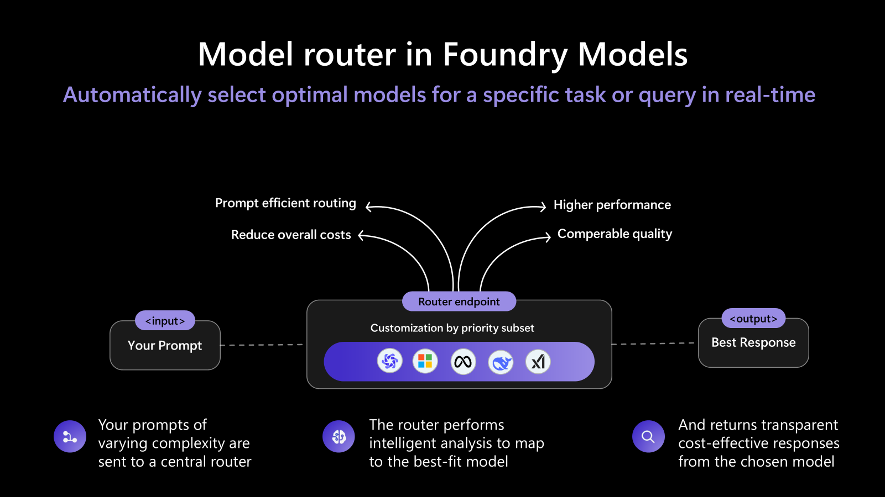

# Lab 01 — Models and Deployment

Step-by-step guide to deploying and consuming models in **Microsoft Foundry**.

> 📖 **Official reference:** [Deploy models in the Foundry portal](https://learn.microsoft.com/azure/foundry/foundry-models/how-to/deploy-foundry-models)

---

## Step 1 — Access the Model Catalog

1. Open the **Microsoft Foundry** portal → [ai.azure.com](https://ai.azure.com)
2. Make sure the **New Foundry** toggle is active in the top banner
3. Select your **project**
4. In the top menu, click **Discover** → in the left panel select **Models**
5. Explore the catalog — thousands of models are available (OpenAI, Meta, Mistral, DeepSeek, etc.)

---

## Step 2 — Deploy a Chat Model (GPT-4o)

1. In the model catalog, search for **GPT-4o** and select it
2. Click **Deploy** → **Custom settings** (or **Default settings** for quick setup)
3. Set the **Deployment name**: `gpt-4o`
4. Choose the tokens-per-minute capacity (the minimum is sufficient for the workshop)
5. Click **Deploy**
6. Wait until the status changes to **Succeeded**

---

## Step 3 — (Optional) Deploy Model Router

Instead of committing to a single model, **Model Router** is a trained language model that **automatically routes your prompts in real time** to the most suitable underlying model — balancing cost, latency, and quality without any extra code on your side.

> 📖 **Official reference:** [Model router in Foundry Models](https://learn.microsoft.com/azure/foundry/openai/concepts/model-router)

### Why does it matter?

In a workshop (and in production) you often face a trade-off:
- Simple questions → cheap, fast models (`gpt-4.1-mini`, `gpt-4.1-nano`)
- Complex reasoning → powerful but expensive models (`o4-mini`, `gpt-5`, `claude-opus`)
- You don't always know in advance which category each prompt falls into

Model Router solves this with a single deployment endpoint that handles 18+ models:

| Routing Mode | What it does | Best for |
|---|---|---|
| **Balanced** (default) | Picks the best quality/cost ratio (within 1–2% quality of best model) | General-purpose workloads |
| **Quality** | Always picks the highest-quality model regardless of cost | Critical outputs, complex reasoning |
| **Cost** | Uses a wider quality band (5–6%) to maximize savings | High-volume, budget-sensitive scenarios |

**Key benefits:**
- 💰 **Lower costs** — simple prompts are automatically routed to cheaper models
- ⚡ **Lower latency** — smaller/faster models used when sufficient
- 🎯 **Maintained quality** — complex tasks still get the best model
- 🔗 **Single endpoint** — one deployment for 18+ models (GPT-4.1, o4-mini, DeepSeek, Llama 4, Claude, Grok, and more)
- 🛡️ **Automatic failover** — if a model has a transient issue, the request is transparently rerouted

### How to deploy

1. Go back to the catalog: **Discover** → **Models**
2. Search for **model-router** and select it
3. Click **Deploy** → set the **Deployment name**: `model-router`
4. Choose deployment type: **Global Standard** (recommended for workshops)
5. Click **Deploy**
6. Once deployed, use it just like any chat model — point your code at `model-router` and routing happens automatically

> 💡 **Tip:** You can also customize the **model subset** — restrict routing to a specific set of models for cost control or compliance reasons.

---

## Step 4 — Deploy an Embeddings Model

1. Go back to the catalog: **Discover** → **Models**
2. Search for **text-embedding-ada-002** (or `text-embedding-3-small`)
3. Click **Deploy** → **Custom settings**
4. Set the **Deployment name**: `text-embedding-ada-002`
5. Click **Deploy**

---

## Step 5 — Verify the Deployments

1. In the top menu, click **Build** → in the left panel select **Models**
2. Verify that both deployments appear with status **Succeeded**

---

## Step 6 — Test in the Playground

1. In the deployments list (**Build** → **Models**), click on the `gpt-4o` deployment
2. The **Playground** opens automatically
3. Send a test message (e.g., "Hello, how are you?")
4. Verify that the model responds correctly
5. Try adjusting parameters in the side panel (temperature, max tokens, etc.)

---

## Step 7 — Consume via Code (Notebook)

1. Open the notebook [`lab01-modelos.ipynb`](lab01-modelos.ipynb)
2. Make sure `.env` is configured (`python setup_env.py`)
3. Run the cells in order — the notebook demonstrates:
   - Connecting to the Foundry endpoint
   - Making **chat completions** calls
   - Adjusting parameters (`temperature`, `max_tokens`, etc.)

---

## Expected Result

- Two models deployed and operational in Foundry
- Model responses via Playground and via Python code
