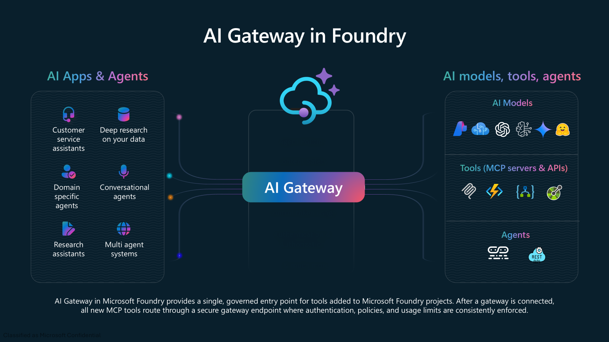
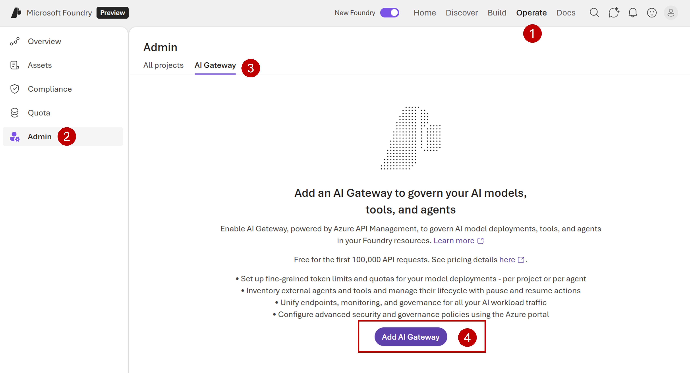

# Lab 06 — Governance with AI Gateway

Step-by-step guide to enabling **AI Gateway** in Microsoft Foundry for governance, token limits, and quota management of your AI models, tools, and agents.

> 📖 **Official reference:** [Configure AI Gateway in your Foundry resources](https://learn.microsoft.com/azure/foundry/configuration/enable-ai-api-management-gateway-portal)

---

## What is AI Gateway?

AI Gateway uses **Azure API Management (APIM)** behind the scenes to provide:

- **Token limits and quotas** per project or per agent
- **Cost control** by capping aggregate usage
- **Multi-team containment** — prevent one project from monopolizing capacity
- **Compliance boundaries** for regulated workloads
- **Governance** of custom agents, MCP tools, and A2A agent tools

> AI Gateway includes a **free tier** for the first 100,000 API requests. See [API Management Pricing](https://azure.microsoft.com/pricing/details/api-management/) for details.

---

## Prerequisites

Before starting, make sure you have:

- [ ] An **Azure subscription** ([create one for free](https://azure.microsoft.com/pricing/purchase-options/azure-account))
- [ ] Permissions to create or reuse an **Azure API Management** instance:
  - **To create**: `Contributor` or `Owner` on the target resource group (or subscription)
  - **To reuse existing**: `API Management Service Contributor` (or `Owner`) on the APIM instance
- [ ] Access to the **Foundry portal Admin console** (e.g., `Azure AI Account Owner` or `Azure AI Owner` on the Foundry resource)
- [ ] A decision on whether to **create a new** or **reuse an existing** APIM instance

---

## Step 1 — Open the AI Gateway Configuration

1. Sign in to [Microsoft Foundry](https://ai.azure.com) — make sure the **New Foundry** toggle is **on** (**①** in the screenshot)
2. In the left panel, click **Admin** (**②**)
3. Open the **AI Gateway** tab (**③**)
4. Click **Add AI Gateway** (**④**)

---

## Step 2 — Create or Select an APIM Instance

1. Select the **Foundry resource** you want to connect with the gateway
2. Choose one of:
   - **Create new** — creates a **Basic v2** SKU instance (suitable for dev/test with SLA support)
   - **Use existing** — select an instance that meets your organization's requirements
3. Name the gateway and click **Add**

> 💡 **Tip:** For production workloads or higher throughput, consider using an existing APIM instance with **Standard v2** or **Premium v2** tier.

### Requirements for existing APIM instances

If you choose **Use existing**, the instance must:
- Be in the **same tenant and subscription** as the Foundry resource
- Use one of the **v2 tiers** (Basic v2, Standard v2, Premium v2)
- **Not** be already associated with another AI Gateway
- You must have `API Management Service Contributor` role on it

> ⚠️ **Private networks:** If your Foundry resource has public network access disabled, your APIM instance must also be privately accessible (Standard v2/Premium v2 with private endpoint or VNet injection).

---

## Step 3 — Verify the Gateway is Provisioned

1. After clicking **Add**, wait for the gateway to appear in the list with status **Enabled**
2. If the status shows **Provisioning**, wait a few minutes and refresh the page (Basic v2 typically takes 5-10 minutes)

---

## Step 4 — Enable Existing Projects

New projects created after AI Gateway setup are **automatically enabled**. For existing projects:

1. Click the **AI Gateway name** to view associated projects
2. In the project list, locate the project you want to enable
3. Check the **Gateway status** column for current status
4. Click **Add project to gateway** — the status updates to **Enabled**

---

## Step 5 — Verify Traffic Routes Through the Gateway

Confirm that requests are flowing through AI Gateway:

1. In the **Azure portal**, open the API Management instance connected to your Foundry resource
2. Go to **Monitoring** → **Metrics** → select **Requests** as the metric
3. Make a test call to a model deployment in the enabled project
4. Verify that the request count increments
5. For detailed logs, go to **Monitoring** → **Logs** and query the **GatewayLogs** table for entries with `200` response code

---

## Step 6 — Configure Token Limits (Optional)

Once AI Gateway is enabled, you can configure governance policies:

1. **Token limits for models** — set TPM (tokens per minute) limits per project or per agent
2. **Custom agent registration** — add custom agents to the Control Plane for governance
3. **MCP tool governance** — govern MCP and A2A agent tools through the gateway

> 📖 **Reference:** [Configure token limits for models](https://learn.microsoft.com/azure/foundry/control-plane/how-to-enforce-limits-models)

---

## Troubleshooting

| Issue | Resolution |
|-------|------------|
| AI Gateway doesn't appear after creation | Wait a few minutes and refresh — Basic v2 provisions in 5-10 min |
| Project shows **Disabled** | Existing projects need manual enabling — click **Add project to gateway** |
| Requests bypass the gateway | Verify gateway status is **Enabled** for both resource and project |
| Permission error when creating | Verify `Contributor` or `Owner` role on the resource group |
| Existing APIM not listed | Check: same tenant, v2 tier, not linked to another gateway, proper RBAC |
| Token limits don't apply | Verify project is enabled for AI Gateway, then configure limits in Admin console |
| 500 errors after setup | Wait for provisioning to complete; check APIM **Monitoring** → **Logs** |

---

## Clean Up

If you created a dedicated APIM instance for this lab:

1. Confirm no other workloads depend on it
2. Disable the AI Gateway for all projects in the associated Foundry resource
3. Remove linked resources in the Azure portal
4. Delete the APIM instance (if not used for other purposes)

---

## Expected Result

- AI Gateway enabled and operational in your Foundry resource
- Projects connected to the gateway with traffic routing through APIM
- Ability to configure token limits, quotas, and governance policies
